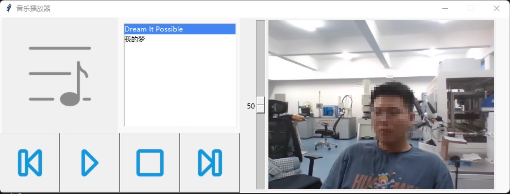

# 基于YOLOv5的视频手势识别交互系统
## 一、 系统流程：
1. 调用笔记本摄像头获取图片
2. 通过**视频抽帧**获取图像
3. 将图像输入到训练好的YOLOv5中，**检测手并完成手势判断**。
4. 对一连串的手势进行**手势意图预测**。
5. 根据预测的意图完成相应的任务。
## 二、 手势及对应任务
1. 左划———上一首歌
2. 右划———下一首歌
3. 上划———调大音量
4. 下划———调小音量
5. 握拳———开始播放
6. 松开———停止播放
7. 打开———打开歌词
8. 关闭———关闭歌词
## 三、 界面展示

